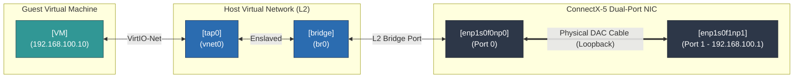
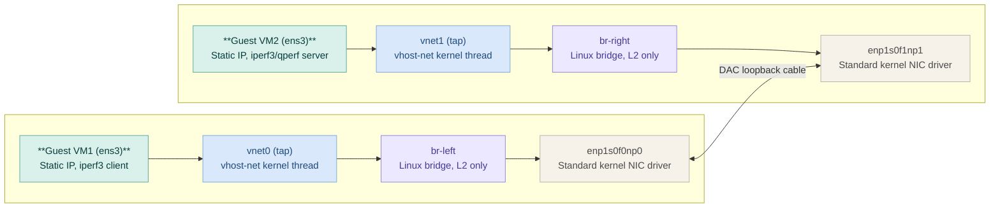

# ConnectX-5 Virtualization Performance Benchmark Report
---

- Platform : Intel ( desktop i5 10th Gen ), 16GB DDR4, 
           Fedora 43 , Kernel: 6.18.16-200 
           PCIe : Gen 3 ( enough for testing 25 Gbps NIC )
           NIC Ports are connected with DAC in crossover configuration. 

- Mellanox CX-5 ( 25 Gbps )

## Benchmark : 

Evaluate virtualization network architecture on Mellanox CX-5 NIC adapter. 
Performance ( throughput /CPU usage) metrics between Pure VirtIO, SR-IOV, OVS-DPDK, vDPA. 

Pure VirtIO : buld TCP throughput and CPU efficiency.
SR-IOV: Near native HW Performancem by-passing Host software bridge. 
OVS-DPDK: Low latency and low packet drop rate ( as its by-passing OS network stack )
vDPA : vhost data path acceleration: CX-5 limitation. (using Linux generic vDPA, CX-5 unable to bind )

- Pure VirtIO: ( Deliver higher bulk TCP )


| Metric         | Pure VirtIO (single)  | PureVirtIO (double)|  OVS-DPDK     | SR-IOV (VF Direct) | vDPA       | Ideal / Best Scenario|
| :---           | :---                  | :---               | :---          | :---               | :---       | :---                 |
| **TCP Throughput** | 23.53 Gbps            | 21.71 Gbps     | 14.31 Gbps    | Pending Test       | N/A (CX6+) |Pure VirtIO (SaaS/Bulk Data) |
| **UDP Packet Rate**| "826,944 pps"         | "668,921 pps"  | "726,220 pps" | Pending Test       | N/A (CX6+) | OVS-DPDK (High PPS)   |
| **UDP Packet Loss**|                       |0.605%          | 0.525%        | Pending Test       | N/A (CX6+) | OVS-DPDK (Reliability)|
| **TCP Latency**    | 15.2 µs               |23.3 µs         | 15.8 µs       | Pending Test       | N/A (CX6+) | OVS-DPDK / SR-IOV (Low Latency) |
| **UDP Latency**    | 13.1 µs               |22.4 µs         | 16.5 µs       | Pending Test       | N/A (CX6+) | OVS-DPDK / SR-IOV (Low Latency) |
| **Host CPU Busy**  | 49.55%                |37.44%          | 44.08%        |   NA               | N/A (CX6+) | SR-IOV (Zero-copy hardware) |


## Test cases:

### Pure VirtIO: 

--- 

    Single Virtual Machine: VM1 [virtnet] <---> [PF0] <--- DAC ---> [PF1] Host 
    Dual Virtual Machines : VM1 [virtnet] <---> [PF0] <--- DAC ---> [PF1] <---> [virtnet] VM2 

**Single VM**


**Dual VM**

```
                                  PHYSICAL DAC LOOPBACK
                                            │
           ┌────────────────────────────────┴────────────────────────────────┐
           │                                                                 │
     [ enp1s0f0np0 ]                                                   [ enp1s0f1np1 ]
  (Standard Kernel Driver)                                          (Standard Kernel Driver)
           │                                                                 │
     +-----+---+                                                       +-----+---+
     | br-left |                                                       |br-right |  <-- Kernel OVS
     +-----+---+                                                       +-----+---+
           │                                                                 │
      [  vnet0  ] (TAP)                                                 [  vnet1  ] (TAP)
           │                                                                 │
      [ vhost-net ] (Kernel)                                            [ vhost-net ] (Kernel)
           │                                                                 │
       VM1 (Kernel)                                                    VM2 (Kernel)
   (Standard TCP/IP)  ◄─────────────────── iperf3 test ────────────────► (Standard TCP/IP)

```




###  SR-IOV Passthrough Case: 

--- 

    Topology: VM1 [virtnet] <---> [VF] <--- Bridge ---> [VF] <---> [virtnet] VM2
    Blocking: SR-IOV bring up on second port fails:

This testing topology provides near wire-speed throughput and sub-10 µs latencies by shifting packet 
processing directly to hardware offload paths and bypassing host CPU queues completely.

Issue Supporting SR-IOV on Desktop chipsets: 

- Attempting to enable one SR-IOV Virtual Function (VF) on both ports of a single CX-5 card: 
- VF creation succeeds on the first port but fails on the second with error:

Error message: 
```bash 
$ sudo dmesg 
... 
mlx5_core 0000:01:00.1: mlx5_sriov_enable:195: pci_enable_sriov failed : -5
pci 0000:01:01.2: [15b3:1018] type 7f class 0xffffff conventional PCI
pci 0000:01:01.2: unknown header type 7f, ignoring device
... 
```
* Each PCIe function's VFs require a addressable function numbers under a PCI device slot.
* A device slot is normally limited to 8 functions (numbers 0–7).
* The first port's VF fit within that range (0000:01:00.2).
* The second port's VF needed function number 2 on a new device number 0000:01:01.2 which requires the 
  upstream PCIe root port to support and forward ARI (Alternate Routing-ID Interpretation).
* Without ARI supporting feature on the mother board, the kernel has no valid bus/device number to place 
  the second VF on. This causes `pci_enable_sriov()` fails immediately (errno -5, EIO) and the "device" the 
  kernel briefly sees at that address is uninitialized (type 7f, i.e. nothing responded).

* ARI support is a root cause and its a complex silicon feature, negotiated between the `NIC` and the `PCIe` 
  slot it's plugged into. 
* ARI support is generally supported by server/workstation chipsets, and commonly absent on desktop chipsets.


### OVS-DPDK: 

--- 

```
    +------------------------------------------------------------------------+
    |                             FEDORA 43 HOST                             |
    |                                                                        |
    |    +--------------------------------------------------------------+    |
    |    |                      BENCHMARK GUEST VM                      |    |
    |    |                                                              |    |
    |    |      [ VM1: (virtio-net]               [ VM2 (virtio-net]    |    |
    |    +--------------|-------------------------------------|---------+    |
    |                   | (vhost-user0)                       |(vhost-user1) |
    |    +--------------|-------------------------------------|---------+    |
    |    |           (br-left)                              (br-right)  |    |
    |    |          OVS-DPDK Switch                      OVS-DPDK Switch|    |
    |    +--------------|---------------------------------------|-------+    |
    |                   |                                       |            |
    |            [ enp1s0f0np0 ]                         [ enp1s0f1np1 ]     |
    |             (dpdk0 port0)                           (dpdk1 port1)      |
    +-------------------|---------------------------------------|------------+
                        +========== Physical DAC Loopback ======+
                            br-mgmt (local, SW only)
                            ssh into both VMs not measured. 
```

```txt 
                 Physical Network
                      │
          ┌───────────┴───────────┐
          │                       │
      PF0 (01:00.0)          PF1 (01:00.1)
          │                       │
      +---------+             +----------+
      | br-left |             | br-right |
      +---------+             +----------+
          │                       │
     vhost-user0             vhost-user1
          │                       │
       VM1 (DPDK)              VM2 (DPDK)

                 Separate management network

        Host (192.168.50.1)
               │
        Linux bridge br-mgmt
           │             │
      tap-mgmt1     tap-mgmt2
           │             │
          VM1           VM2
```

- prepare the system to use Open vSwitch (OVS) with DPDK as a very fast sw-switch connecting two physical
  NIC ports of CX5 to two VM using `vhost-user`. 


Additional info ./benchmark/OVS-DPDK/ovs-dpdk-test/readme.md 

### vDPA (vhost Data Path Acceleration) Limitation:

--- 

Not compatible with current HW.
Kernel support generic vDPA: ( workaround ): 
   Hardware acceleration for vDPA using `librte_vdpa_mlx5` or the kernel `mlx5_vdpa` module requires CX-6 
   family or higher. 
   CX-5 lacks the necessary internal firmware objects (DevX/Virtio layout offloads) needed to drive vDPA 
   datapaths directly in hardware.

More info @ : ./benchmark/vDPA/ 
