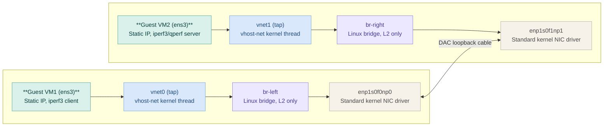

```txt
   [ SETUP : PURE VIRTIO (KERNEL) ]
   =================================

             +-----------+
             | VM (Kern) | <-- (e.g., iperf3)
             +-----+-----+
                   | (Standard virtio-net)
             [ virtio-net ]
                   |
           (vhost-net Ring)
                   |
             [ TAP Device ] (vnet0)
                   |
          +--------v--------+
          | Linux OVS (Kern)|
          |  (Kernel-space) |
          +--------+--------+
                   | (Standard kernel driver,
                   |  e.g., mlx5_core / ixgbe)
          +--------v--------+
          |  Physical NIC   |
          +-----------------+
```

Dual VM throughput test using CX5:

```
                                  PHYSICAL DAC LOOPBACK
                                            │
           ┌────────────────────────────────┴────────────────────────────────┐
           │                                                                 │
     [ enp1s0f0np0 ]                                                   [ enp1s0f1np1 ]
  (Standard Kernel Driver)                                          (Standard Kernel Driver)
           │                                                                 │
     +-----+---+                                                       +-----+---+
     | br-left |                                                       |br-right |  <-- Kernel OVS
     +-----+---+                                                       +-----+---+
           │                                                                 │
      [  vnet0  ] (TAP)                                                 [  vnet1  ] (TAP)
           │                                                                 │
      [ vhost-net ] (Kernel)                                            [ vhost-net ] (Kernel)
           │                                                                 │
       VM1 (Kernel)                                                    VM2 (Kernel)
   (Standard TCP/IP)  ◄─────────────────── iperf3 test ────────────────► (Standard TCP/IP)

```




## Kernel boot arguments:

If the current boot arguments are set to a different benchmark test case then remove them for example:

$sudo grubby --update-kernel=DEFAULT --remove-args="intel_iommu=on iommu=pt pci=realloc,assign-busses pcie_acs_override=downstream,multifunction"

$sudo grubby --update-kernel=DEFAULT --args="processor.max_cstate=1 intel_idle.max_cstate=1"

$sudo grubby --info=DEFAULT   # verify before rebooting
index=0
kernel="/boot/vmlinuz-6.18.16-200.fc43.x86_64"
args="ro rhgb quiet $tuned_params default_hugepagesz=1G hugepagesz=1G hugepages=12 isolcpus=2-7 nohz_full=2-7 rcu_nocbs=2-7 selinux=0 processor.max_cstate=1 intel_idle.max_cstate=1"
root="UUID=01f43f27-c2e8-4447-9f38-caa81e00c428"
initrd="/boot/initramfs-6.18.16-200.fc43.x86_64.img $tuned_initrd"
title="Fedora Linux (6.18.16-200.fc43.x86_64) 43 (KDE Plasma Desktop Edition)"
id="00869ccad6574c89bea761dcff7f7501-6.18.16-200.fc43.x86_64"

$ shutdown -r now

## Full Run order: 

- `./01-host_virtio_dualport_setup.sh`

- `./02-build_virtio_vm_image.sh vm1 192.168.50.11 52:54:00:00:01:01 192.168.101.10 52:54:00:aa:bb:01`
  `./02-build_virtio_vm_image.sh vm2 192.168.50.12 52:54:00:00:01:02 192.168.101.20 52:54:00:aa:bb:02`

- `./03-launch_virtio_vm_generic.sh vm1 vnet0 52:54:00:aa:bb:01 tap-mgmt1 52:54:00:00:01:01 4,5`
  `./03-launch_virtio_vm_generic.sh vm2 vnet1 52:54:00:aa:bb:02 tap-mgmt2 52:54:00:00:01:02 6,7`

- `./04-run_test_virtio_dualvm.sh pure_virtio_dualvm_run1`

---
 test run 1
./04-run_test_virtio_dualvm.sh virtIO-dual-vm-test1
===== Pure-virtio (Linux bridge + vhost-net) dual-VM run: virtIO-dual-vm-test1 =====
[1/3] TCP throughput...
[2/3] UDP PPS (Note: limited by guest kernel socket speed)...
[3/3] Latency (qperf)...

===== SUMMARY =====
  tcp_throughput_gbps: 21.8
  udp_pps: 664976.0
  udp_lost_percent: 1.094
  tcp_latency: 23.7 us
  udp_latency: 21.4 us
  host_cpu_busy_pct: 37.77
  note: This is the pure-virtio (Linux bridge + vhost-net) run - no OVS/DPDK involved. host_cpu_busy_pct
  includes vhost-net kernel worker threads, which only consume CPU while actively forwarding packets (unlike
  DPDK PMD threads, which busy-poll at ~100% even when idle). Check vhost_threads_before/after.txt for
  kernel thread placement (psr column = host core) and ethtool_*_before/after.txt to confirm rx/tx_packets
  climbed on the physical NICs during the run.

Done. Full logs in ./results/virtIO-dual-vm-test1/ 

---

./04-run_test_virtio_dualvm.sh pure_virtIO-dual-vm-test
===== Pure-virtio (Linux bridge + vhost-net) dual-VM run: pure_virtIO-dual-vm-test =====
[1/3] TCP throughput...
[2/3] UDP PPS (Note: limited by guest kernel socket speed)...
[3/3] Latency (qperf)...

===== SUMMARY =====
  tcp_throughput_gbps: 21.71
  udp_pps: 668921.0
  udp_lost_percent: 0.605
  tcp_latency: 23.3 us
  udp_latency: 22.4 us
  host_cpu_busy_pct: 37.44
  note: This is the pure-virtio (Linux bridge + vhost-net) run - no OVS/DPDK involved. host_cpu_busy_pct
  includes vhost-net kernel worker threads, which only consume CPU while actively forwarding packets (unlike
  DPDK PMD threads, which busy-poll at ~100% even when idle). Check vhost_threads_before/after.txt for
  kernel thread placement (psr column = host core) and ethtool_*_before/after.txt to confirm rx/tx_packets
  climbed on the physical NICs during the run.

Done. Full logs in ./results/pure_virtIO-dual-vm-test/
