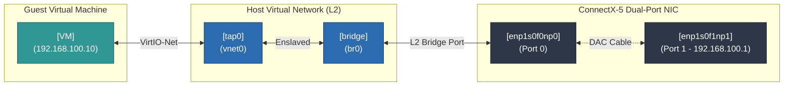

# VM Launch Script:





## Benchmark requirements:

- Generate VM's
- Launch high performance VM instance with required setup 
- Automate performance benchmarning test ( generate reports ) and customization:


## Generate VM using cloud-init

Script uses `cloud-init` to automate the provisioning of the guest VM image, injecting static IP networking,
downloading performance utilities, and registering the background `iperf3` and `qperf` systemd services 
before the VM even boots.

1. Config & Environment Definitions:

- Assign Key variables (user credentials, static IP 192.168.100.10, and hostname). 
  The host physical interface must be manually assigned a matching subnet IP (192.168.100.1) to complete 
  the Direct Attach Copper (DAC) physical loopback connection.


```bash
#!/bin/bash
set -euo pipefail
### ---- Config ----
BASE_IMAGE="quay.io/containerdisks/fedora:41"
WORKDIR="$(pwd)/guest-image"
BASE_IMG="${WORKDIR}/guest-base.img"
OVERLAY_QCOW2="./guest.qcow2"
SEED_ISO="./seed.iso"
DISK_SIZE="20G"          # overlay virtual size cap; base image itself is small (cloud image, sparse)
GUEST_HOSTNAME="virtio-guest"
GUEST_USER="bench"
GUEST_PASSWORD="test1234"
GUEST_IP="192.168.100.10"
GUEST_PREFIX="24"
# NOTE: host-side counterpart (not managed by this script) - assign the matching
# subnet IP to the host interface that completes the DAC loopback path, e.g.:
#   sudo ip addr add 192.168.100.1/24 dev enp1s0f1np1
#   sudo ip link set enp1s0f1np1 up
# Do NOT put an IP on br0 itself - keep it pure L2 to avoid a same-subnet conflict.
```

2. Containerdisk Extraction (Steps 1 & 2)

Instead of downloading a massive, .qcow2 file over HTTPS, the script pulls a cloud-optimized raw disk 
packaged inside a Container Image (containerdisks).
- Because these scratch containers have no execution layer, it uses `podman create` to instantiate it
  natively.

- It pipes `podman export` through `tar` to dynamically parse and find the file path of the inner raw image
  file (disk/disk.img).

- It copies the file out to your host using `podman cp` and queries `qemu-img info` to inspect and save its
  underlying file format (usually raw).


```bash
mkdir -p "${WORKDIR}"
### ---- Step 1: Pull base containerdisk image ----
echo "[1/5] Pulling base image: ${BASE_IMAGE}"
podman pull "${BASE_IMAGE}"

### ---- Step 2: Extract qcow2 from the container ----
echo "[2/5] Extracting qcow2 from container"
# containerdisks images are FROM scratch - no shell, no entrypoint we can exec.
# Use 'create' (never runs anything) + 'export' (tars the rootfs) to find/extract the disk.
CID=$(podman create "${BASE_IMAGE}")
trap 'podman rm -f "${CID}" >/dev/null 2>&1 || true' EXIT

DISK_PATH_IN_CONTAINER="${DISK_PATH_IN_CONTAINER:-}"
if [[ -z "${DISK_PATH_IN_CONTAINER}" ]]; then
    # containerdisks images name the file disk/disk.img regardless of actual format
    # (usually raw, sometimes qcow2 internally) - match by path, not extension.
    DISK_PATH_IN_CONTAINER=$(podman export "${CID}" | tar -tv | awk '{print $NF}' | grep -E '^disk/disk\.(img|qcow2|raw)$' | head -n1 || true)
fi
if [[ -z "${DISK_PATH_IN_CONTAINER}" ]]; then
    # fallback: any regular file under disk/
    DISK_PATH_IN_CONTAINER=$(podman export "${CID}" | tar -tv | grep -E '^-' | awk '{print $NF}' | grep -E '^disk/' | head -n1 || true)
fi
if [[ -z "${DISK_PATH_IN_CONTAINER}" ]]; then
    echo "ERROR: could not locate any .qcow2 file inside the container image."
    echo "Full container filesystem listing:"
    echo "-----------------------------------"
    podman export "${CID}" | tar -tv
    echo "-----------------------------------"
    echo "Copy the correct path from above and either:"
    echo "  a) rerun with: DISK_PATH_IN_CONTAINER=/path/to/file.qcow2 $0"
    echo "  b) edit the grep pattern in this script to match it"
    exit 1
fi
DISK_PATH_IN_CONTAINER="/${DISK_PATH_IN_CONTAINER#/}"
echo "  found: ${DISK_PATH_IN_CONTAINER}"

if [[ ! -f "${BASE_IMG}" ]]; then
    podman cp "${CID}:${DISK_PATH_IN_CONTAINER}" "${BASE_IMG}"
    echo "  saved to ${BASE_IMG}"
else
    echo "  ${BASE_IMG} already exists, skipping re-copy (delete it to force re-extract)"
fi

podman rm -f "${CID}" >/dev/null 2>&1 || true
trap - ERR EXIT

# Detect actual format - containerdisks' disk.img is usually raw despite ambiguous naming.
# Use plain-text output, not --output=json: newer qemu-img nests multiple "format" keys
# (protocol layer + guest format), which breaks naive JSON key extraction.
BASE_FORMAT=$(qemu-img info "${BASE_IMG}" | awk -F': ' '/^file format:/{print $2}')
if [[ -z "${BASE_FORMAT}" ]]; then
    echo "ERROR: could not determine format of ${BASE_IMG}"
    qemu-img info "${BASE_IMG}"
    exit 1
fi
echo "  detected format: ${BASE_FORMAT}"
```


3. Thin-Provisioned Copy-on-Write storage

To optimize storage, the script creates a `QCOW2` Writable Overlay linked to the un-modified base image as 
a backing file (`-b`).
- The primary base disk remains completely read-only.
- The file `guest.qcow2` starts tiny (a few kilobytes) and only logs localized disk variations during 
  runtime, protecting your clean base image from mutation.
```bash
### ---- Step 3: Create writable overlay for the actual test VM ----
echo "[3/5] Creating writable overlay: ${OVERLAY_QCOW2}"
if [[ -f "${OVERLAY_QCOW2}" ]]; then
    echo "  ${OVERLAY_QCOW2} already exists — skipping (delete it first if you want a fresh overlay)"
else
    qemu-img create -f qcow2 -F "${BASE_FORMAT}" -b "$(realpath "${BASE_IMG}")" "${OVERLAY_QCOW2}" "${DISK_SIZE}"
fi
qemu-img info "${OVERLAY_QCOW2}"
```

4. Cloud-Init schema Injection :

Generates a standard user-data text configuration payload. When the VM boots for the first time, the
`cloud-init` engine processes this block to configure the operating system state:

- User Management: Generates a username/password:  `bench`/`test1234`, gives them root privileges 
  (NOPASSWD:ALL), and installs a fallback SSH key.

- Network Manager Config: Deploys an isolated, pure L2 static network layout on the VM interface `ens3` with
  your test IP.

- Service Generation: It writes custom, persistent Systemd unit descriptors directly to
  "/etc/systemd/system/" for both iperf3-server.service and qperf-server.service.

- Guest-Monitor Framework: It drops a monitoring shell script (/usr/local/bin/guest-monitor.sh) to locally
  harvest guest-side CPU and network statistics (mpstat, /proc/interrupts, ethtool) whenever the host
  triggers the parameterized guest-monitor@.service.

-  Execution Block (runcmd): Signals the OS to reload daemon states, bring up the static network
   configuration, and spin up the background network listener servers immediately.

```bash
### ---- Step 4: Write cloud-init user-data / meta-data ----
echo "[4/5] Writing cloud-init config"
mkdir -p cloud-init
cat > cloud-init/user-data <<EOF
#cloud-config
hostname: ${GUEST_HOSTNAME}

users:
  - name: ${GUEST_USER}
    plain_text_passwd: ${GUEST_PASSWORD}
    lock_passwd: false
    sudo: ALL=(ALL) NOPASSWD:ALL
    shell: /bin/bash
    groups: wheel
    ssh_authorized_keys:
       - ssh-rsa AAAAB3NzaC1yc2EAAAADAQABAAABgQCR8FFSrwiycT9Ez+IL0TtY0z9f2IjO4rlwfbo4Kf0ulAVjlBn3Y+hkh3OBptnhN28dVTRWCFakBh8uB7kpBGfe7E844O5JxVIAefNqTIWLQHGV+IzX5ggf1Vw7f6l2uny9XSczsY3zUSBnPLpi1cd4nyy4ZDJrVkJHwx6/8JEGmCU32fhrwmgkvfHGUJMzXt/AP6LW7yKvRTtflloE3BEfmWrNemAg1j/bM398OQFQmtIRltecCWF2n8idJgm6jsd0uUK7bCOXy2UafQhlqLPSFB/+5Wi3Y/HzzvUwqTWCvnPlj3LOgbpOV+mEKqdlLsCqeGUUl3qrk5PL4qTgUMXwHma4ckn8WM2fCs1gl/I+WfR5Xh8pjH7u0pO5LS1dUP+gg47iYUbBm+I6cCbOOquTkcnZf+NtENbSSpmp8nIxXRr/iopc45+2CptkgjUG5WweX/Bpl97NpDngy1fBC2k9FL4oNaHEwfE2E11KrcHRmkn11sQ50txUKcpYxx/zU4U= devram@devram-ms7c88

ssh_pwauth: true

packages:
  - iperf3
  - sysstat
  - NetworkManager
  - mpstat
  - qperf

write_files:
  - path: /etc/NetworkManager/system-connections/eth0-static.nmconnection
    permissions: '0600'
    content: |
      [connection]
      id=eth0-static
      type=ethernet
      interface-name=ens3
      autoconnect=true
      autoconnect-priority=999

      [ethernet]
      mac-address=52:54:00:12:34:56

      [ipv4]
      method=manual
      address1=${GUEST_IP}/${GUEST_PREFIX}
      # no gateway/dns - isolated point-to-point test segment, not routed

      [ipv6]
      method=disabled

  - path: /etc/systemd/system/iperf3-server.service
    permissions: '0644'
    content: |
      [Unit]
      Description=iperf3 server (persistent, auto-restart)
      After=network-online.target
      Wants=network-online.target

      [Service]
      ExecStart=/usr/bin/iperf3 -s -p 5201
      Restart=always
      RestartSec=2

      [Install]
      WantedBy=multi-user.target

  - path: /etc/systemd/system/qperf-server.service
    permissions: '0644'
    content: |
      [Unit]
      Description=qperf server (persistent, auto-restart)
      After=network-online.target
      Wants=network-online.target

      [Service]
      ExecStart=/usr/bin/qperf
      Restart=always
      RestartSec=2

      [Install]
      WantedBy=multi-user.target

  - path: /usr/local/bin/guest-monitor.sh
    permissions: '0755'
    content: |
      #!/bin/bash
      RUN="\${1:-manual_run}"
      DURATION="\${2:-70}"
      OUTDIR="/var/log/bench/\${RUN}"
      mkdir -p "\${OUTDIR}"
      mpstat -P ALL 1 "\${DURATION}" > "\${OUTDIR}/guest_cpu.log" &
      cat /proc/interrupts | grep virtio > "\${OUTDIR}/interrupts_before.txt"
      wait
      cat /proc/interrupts | grep virtio > "\${OUTDIR}/interrupts_after.txt"
      ethtool -S ens3 > "\${OUTDIR}/ethtool_after.txt" 2>/dev/null
      echo "guest monitor done: \${RUN}" > "\${OUTDIR}/DONE"

  - path: /etc/systemd/system/guest-monitor@.service
    permissions: '0644'
    content: |
      [Unit]
      Description=Guest-side monitoring for run %i

      [Service]
      Type=simple
      ExecStart=/usr/local/bin/guest-monitor.sh %i 70

runcmd:
  - [ chmod, '600', /etc/NetworkManager/system-connections/eth0-static.nmconnection ]
  - [ systemctl, daemon-reload ]
  - [ systemctl, enable, --now, NetworkManager ]
  - [ nmcli, connection, reload ]
  - [ nmcli, connection, up, eth0-static ]
  - [ systemctl, enable, --now, iperf3-server.service ]
  - [ systemctl, enable, --now, qperf-server.service ]
  - [ mkdir, -p, /var/log/bench ]

final_message: "cloud-init finished, eth0 should be ${GUEST_IP}/${GUEST_PREFIX}"
EOF

cat > cloud-init/meta-data <<EOF
instance-id: ${GUEST_HOSTNAME}-01
local-hostname: ${GUEST_HOSTNAME}
EOF
```

5. Metadata Packaging & Seed Compilation:

- `genisoimage -output "${SEED_ISO}" -volid cidata ...`

Because Qemu virtual machines cannot natively parse plaintext configuration files on the host filesystem
during early initialization, cloud-init requires configuration states to be wrapped into an ISO image
filesystem labeled explicitly with the volume name cidata.

```bash
### ---- Step 5: Build seed.iso ----
echo "[5/5] Building ${SEED_ISO}"
if command -v cloud-localds >/dev/null 2>&1; then
    cloud-localds "${SEED_ISO}" cloud-init/user-data cloud-init/meta-data
elif command -v genisoimage >/dev/null 2>&1; then
    genisoimage -output "${SEED_ISO}" -volid cidata -joliet -rock cloud-init/user-data cloud-init/meta-data
elif command -v xorriso >/dev/null 2>&1; then
    xorriso -as genisoimage -output "${SEED_ISO}" -volid cidata -joliet -rock cloud-init/user-data cloud-init/meta-data
else
    echo "No ISO tool found on host (cloud-localds / genisoimage / xorriso)."
    echo "Falling back to podman-based genisoimage container:"
    podman run --rm -v "$(pwd)/cloud-init:/data:Z" -w /data \
        quay.io/cloud-init/genisoimage \
        genisoimage -output /data/seed.iso -volid cidata -joliet -rock user-data meta-data
    mv cloud-init/seed.iso "${SEED_ISO}"
fi

echo
echo "Done."
echo "  Base image : ${BASE_IMG}"
echo "  Overlay    : ${OVERLAY_QCOW2}  <-- point QEMU's DISK= at this"
echo "  Seed ISO   : ${SEED_ISO}       <-- point QEMU's SEED= at this"
echo
echo "  Guest login: ssh ${GUEST_USER}@${GUEST_IP}  (password: ${GUEST_PASSWORD})"
echo "  Guest IP   : ${GUEST_IP}/${GUEST_PREFIX} (static, no gateway/DNS)"
echo "  Reminder   : set the matching host-side IP on the DAC-loopback interface, e.g.:"
echo "               sudo ip addr add ${GUEST_IP%.*}.1/${GUEST_PREFIX} dev <host_iface>"
echo "               (do NOT put an IP on br0 itself)"

echo "Install the required packages"
sudo virt-customize -a ./guest.qcow2 --install iperf3,sysstat,mpstat,qperf 
```

---


## Virtual Machine Launch script:

1. 
```bash
#!/bin/bash
set -euo pipefail
```

- `-e`: Exit immediately if any command returns a non-zero status.
- `-u`: Treat unset variables as errors and exit.
- `-o pipefail`: Ensure if any cmd in a pipeline fails (e.g., cmd1 | cmd2 ), the entire pipeline's exit status is used, 
   rather than just the last command.
   
   
2. Defines variables for the VM resources 
   (4 vCPUs, 2GB RAM), paths to the storage disks (guest.qcow2 and a Cloud-Init seed.iso), and 
   network interface/bridge configurations.
   
```bash
RUN=virtio_tcp_run1
VCPUS=4
MEM=2G
DISK="$(realpath ./guest.qcow2)"
SEED="$(realpath ./seed.iso)"
MONITOR_SOCK=/tmp/qemu-monitor-${RUN}.sock
SERIAL_LOG=/tmp/qemu-${RUN}-serial.log
PHYS_IFACE=enp1s0f0np0
BRIDGE=br0
TAP=vnet0
VCPU_PIN=(2 3 4 5)      # isolated cores for guest vCPUs
VHOST_PIN=(6 7)         # isolated cores for vhost-net kernel threads, disjoint from VCPU_PIN
```

3. Pre-flight Sanity Checks:
   
Before launching anything, the script performs robust checks to prevent silent failures:

- Disk Presence: Confirms the OS disk and configuration seed ISO actually exist.
- Hugepages Check: It checks /proc/meminfo to ensure there are at least 1024 free Hugepages (typically 2MB each, totaling 2GB). 
  Hugepages reduce memory translation overhead, vastly improving VM memory performance.
- Kernel Modules: Loads and verifies vhost_net (kernel-level virtualization for network data paths) and checks that /dev/kvm is accessible.
- Conflict Prevention: Ensures another instance of this specific QEMU run (virtio_tcp_run1) isn't already running.

```bash
### ---- Pre-flight sanity checks ----
[[ -f "${DISK}" ]] || { echo "ERROR: ${DISK} not found"; exit 1; }
[[ -f "${SEED}" ]] || { echo "ERROR: ${SEED} not found"; exit 1; }

FREE_HP=$(grep HugePages_Free /proc/meminfo | awk '{print $2}')
if [[ "${FREE_HP}" -lt 1024 ]]; then
    echo "ERROR: only ${FREE_HP} free hugepages, need >=1024 for ${MEM}"
    exit 1
fi

lsmod | grep -q vhost_net || sudo modprobe vhost_net
[[ -e /dev/vhost-net ]] || { echo "ERROR: /dev/vhost-net missing after modprobe"; exit 1; }
[[ -e /dev/kvm ]] || { echo "ERROR: /dev/kvm missing"; exit 1; }

pgrep -f "qemu-${RUN}" >/dev/null && { echo "ERROR: a qemu process named qemu-${RUN} is already running"; exit 1; }
rm -f "/tmp/qemu-${RUN}.pid" "${MONITOR_SOCK}"

```


4. Host Network Preparation:
The script sets up a bridged networking environment on the host so the VM can communicate directly with the outside world. 
Because this is idempotent, it only configures these if they don't already exist:

- `br0`: Creates a sw bridge, attaches your physical network interface (enp1s0f0np0) to it, and brings them up.
- Tap Interface (`vnet0`): Creates a virtual TAP interface in multi_queue mode (which allows multiple CPU cores to process network packets 
  in parallel) and plugs it into the bridge.
- Validation: Confirms that both the physical interface and the TAP interface are successfully linked to the bridge.

```bash
### ---- Host network prep (idempotent) ----
if ! ip link show ${BRIDGE} &>/dev/null; then
    sudo ip link add ${BRIDGE} type bridge
    sudo ip link set ${PHYS_IFACE} master ${BRIDGE}
    sudo ip addr flush dev ${PHYS_IFACE}
    sudo ip link set ${PHYS_IFACE} up
    sudo ip link set ${BRIDGE} up
fi

if ! ip link show ${TAP} &>/dev/null; then
    sudo ip tuntap add dev ${TAP} mode tap multi_queue user $(whoami)
    sudo ip link set ${TAP} master ${BRIDGE}
    sudo ip link set ${TAP} up
fi

bridge link show ${TAP} | grep -q "master ${BRIDGE}" || { echo "tap not enslaved"; exit 1; }
bridge link show ${PHYS_IFACE} | grep -q "master ${BRIDGE}" || { echo "phys iface not enslaved"; exit 1; }
```

5. Launching QEMU VM: ( with High performance parameters )

- `-enable-kvm -cpu host`: Uses HW accel and passes the host CPU’s exact features (and cache topology) directly into the guest.
- `-m 2G -object memory-backend-file... -numa node`: Forces the VM's memory to be backed by the host's 2MB Hugepages (/dev/hugepages) for raw speed.

- `-drive ...,cache=none,aio=native`: Uses native async I/O and bypasses host-side caching for the fastest, safest virtual disk performance.

- `-netdev tap,...,vhost=on,queues=4`: Offloads network processing to the Linux kernel (vhost=on) and sets up 4 queues (matching the 4 vCPUs) to
   scale network throughput.
   
- `-device virtio-net-pci,mq=on`: Enables Multi-Queue (mq=on) inside the VM's network card.

- `-display none -daemonize`: Runs the VM entirely in the background without a graphical interface.

```bash
qemu-system-x86_64 \
  -name guest,process=qemu-${RUN} \
  -enable-kvm -cpu host,host-cache-info=on -smp ${VCPUS},sockets=1,cores=${VCPUS},threads=1 \
  -m ${MEM} \
  -object memory-backend-file,id=mem,size=${MEM},mem-path=/dev/hugepages,share=on \
  -numa node,memdev=mem \
  -drive file=${DISK},if=virtio,format=qcow2,cache=none,aio=native \
  -drive file=${SEED},if=virtio,format=raw,readonly=on \
  -netdev tap,id=net0,ifname=${TAP},script=no,downscript=no,vhost=on,queues=${VCPUS} \
  -device virtio-net-pci,netdev=net0,mq=on,vectors=$((2*VCPUS+2)),disable-legacy=on,mac=52:54:00:12:34:56 \
  -monitor unix:${MONITOR_SOCK},server,nowait \
   -serial file:${SERIAL_LOG} \
  -display none \
  -daemonize \
  -pidfile /tmp/qemu-${RUN}.pid
```

6. VM Startup Verification

After issuing the boot command, the script pauses for 2 seconds (sleep 2), reads the generated Process ID (PID) file, 
and uses kill -0 <PID> to verify that the QEMU process didn't instantly crash. 
If it did, it warns you to check the serial logs.

```bash
### ---- Confirm it actually started ----
sleep 2
if [[ ! -f "/tmp/qemu-${RUN}.pid" ]]; then
    echo "ERROR: QEMU failed to start - check ${SERIAL_LOG} and dmesg"
    exit 1
fi
QEMU_PID=$(cat /tmp/qemu-${RUN}.pid)
if ! kill -0 "${QEMU_PID}" 2>/dev/null; then
    echo "ERROR: QEMU pid ${QEMU_PID} not running - check ${SERIAL_LOG}"
    exit 1
fi
```

7.  Strict vCPU Pinning (CPU Affinity):

By default, the Linux kernel scheduler might move QEMU's vCPU threads across different physical cores, 
destroying CPU cache efficiency.

final block of code scans the host's /proc directory for the active threads of the QEMU process, identifies 
the specific threads representing virtual CPUs (CPU*), and uses taskset to pin them:

- vCPU 0 is pinned to physical core 2
- vCPU 1 is pinned to physical core 3
- vCPU 2 is pinned to physical core 4
- vCPU 3 is pinned to physical core 5

```bash
### ---- Pin vCPU threads ----
i=0
for tid in $(ls /proc/${QEMU_PID}/task | tail -n +2); do
    comm=$(cat /proc/${QEMU_PID}/task/${tid}/comm)
    if [[ "$comm" == CPU* ]]; then
        taskset -pc ${VCPU_PIN[$i]} ${tid}
        i=$((i+1))
    fi
done

echo "QEMU launched, PID ${QEMU_PID}, monitor at ${MONITOR_SOCK}"
echo "Serial console log: ${SERIAL_LOG}"
echo "NOTE: run pin_vhost.sh AFTER guest boots and traffic starts (vhost threads spawn lazily)"
```

---

## Automate performance benchmarning test ( generate reports ) and customization:

Automated performance benchmarking this has to run after launching VM to stress-test and evaluate the
guest VM's network performance.

Collects bandwidth test, and profiles to capture system metrics before, during, and after the workload,
Runs 3 distinct network tests (Throughput, Packet Rate, and Latency), and then aggregates all the data 
into a clean, human-readable summary.

Script operates in 6 phase pipeline:

```txt
[Phase 1: Pre-checks] =>  [Phase 2: Baseline Stats] =>  [Phase 3: background Monitors] 
                                                                  │
                                                                  v
[Phase 6: Python Summary] <= [Phase 5: Final Stats & Logs] <= [Phase 4: RUN BENCHMARKS]
```

1. Same as above:
#!/bin/bash
set -euo pipefail

2. Configuration and argument parser:

Usage, creates a dedicated folder to isolate and store raw log files, JSON payloads and 
system stats for this specific test run. 

```bash
### ---- Config ----
RUN="${1:?Usage: $0 <run_name>   e.g. virtio_tcp_run1}"
GUEST_IP="192.168.100.10"
GUEST_USER="bench"
HOST_IFACE="enp1s0f1np1"     # port1 - the host-side interface completing the DAC loop
DURATION=60
MONITOR_BUFFER=10             # extra seconds so monitors outlast the workload
MONITOR_DURATION=$((DURATION + MONITOR_BUFFER))

OUTDIR="./results/${RUN}"
mkdir -p "${OUTDIR}"

echo "===== Run: ${RUN} ====="
echo "Output dir: ${OUTDIR}"
```

3. Pre run test:

Before running benchmarks, it attempts a quick, non-interactive SSH ping to the guest VM. 
If the VM is down or SSH keys aren't configured properly, the script fails immediately with a clear error.

```bash
### ---- Pre-checks ----
ssh -o BatchMode=yes -o ConnectTimeout=5 ${GUEST_USER}@${GUEST_IP} true \
    || { echo "ERROR: cannot SSH to guest at ${GUEST_IP}"; exit 1; }
```

4. Baseline Snapshots ("Before" State) Before the test starts:
- Takes a snapshot of physical and virtual system counters before the test begins:
- `ethtool -S`: Captures hardware-level network interface statistics (like packet drops, ring buffer status, and errors) 
   on both the host and guest.
- `/proc/interrupts`: Logs how CPU interrupts are balanced across cores on both the host and the guest 
   (essential for diagnosing CPU pinning and IRQ handling bottlenecks).
   
5. Background Monitoring (Host & Guest)

Right before starting the network load, the script triggers a series of async (background &) monitors that collect 
system telemetry every 1 second for the duration of the test:

```bash
### ---- Snapshot counters before ----
ethtool -S ${HOST_IFACE} > "${OUTDIR}/ethtool_host_before.txt" 2>/dev/null || true
cat /proc/interrupts > "${OUTDIR}/interrupts_host_before.txt"
ssh ${GUEST_USER}@${GUEST_IP} "ethtool -S ens3 2>/dev/null; cat /proc/interrupts | grep virtio" \
    > "${OUTDIR}/guest_before.txt" || true
```

6. 
|Tool / Service	|Location	|What it Monitors|
| :--- | :--- | :--- |
|mpstat	                        |Host	|CPU utilization broken down by individual core (-P ALL).|
|pidstat                        |Host	|Thread-level CPU utilization specifically for the QEMU process.|
|sar -n DEV	                    |Host	|Real-time network throughput (PPS and bandwidth) on host interfaces.|
|systemctl start guest-monitor	|Guest	|Triggers a systemd service inside the VM to run equivalent local monitoring.|


```bash
### ---- Start host-side monitoring (self-terminating) ----
mpstat -P ALL 1 ${MONITOR_DURATION}  > "${OUTDIR}/host_cpu.log" &
QEMU_PID=$(pgrep -f "qemu-.*${RUN%%_*}" || pidof qemu-system-x86_64 || true)
if [[ -n "${QEMU_PID}" ]]; then
    pidstat -t -p "${QEMU_PID}" 1 ${MONITOR_DURATION} > "${OUTDIR}/qemu_threads.log" &
fi
sar -n DEV 1 ${MONITOR_DURATION}     > "${OUTDIR}/host_network.log" &
### ---- Start guest-side monitoring ----
ssh ${GUEST_USER}@${GUEST_IP} "sudo systemctl start guest-monitor@${RUN}.service"

# give monitors a moment to actually start sampling before workload begins
sleep 2

### ---- 1. Throughput (TCP) ----
echo "[1/3] TCP throughput (${DURATION}s)..."
iperf3 -c ${GUEST_IP} -p 5201 -t ${DURATION} -P 4 -J > "${OUTDIR}/iperf3_tcp.json"

### ---- 2. Packet rate (small-packet UDP) ----
echo "[2/3] UDP small-packet PPS (${DURATION}s)..."
iperf3 -c ${GUEST_IP} -p 5201 -u -l 64 -b 5G -t ${DURATION} -J > "${OUTDIR}/iperf3_udp_pps.json"

### ---- 3. Latency ----
echo "[3/3] Latency (qperf tcp_lat, udp_lat)..."
qperf ${GUEST_IP} tcp_lat udp_lat > "${OUTDIR}/qperf_latency.txt" 2>&1 || \
    echo "qperf failed - check qperf-server.service status on guest" | tee -a "${OUTDIR}/qperf_latency.txt"

### ---- Wait for monitors to finish ----
wait

### ---- Snapshot counters after ----
ethtool -S ${HOST_IFACE} > "${OUTDIR}/ethtool_host_after.txt" 2>/dev/null || true
cat /proc/interrupts > "${OUTDIR}/interrupts_host_after.txt"

### ---- Pull guest logs ----
until ssh ${GUEST_USER}@${GUEST_IP} "test -f /var/log/bench/${RUN}/DONE" 2>/dev/null; do
    sleep 2
done
scp -rq ${GUEST_USER}@${GUEST_IP}:/var/log/bench/${RUN} "${OUTDIR}/guest_logs"
ssh ${GUEST_USER}@${GUEST_IP} "ethtool -S ens3 2>/dev/null" > "${OUTDIR}/guest_after.txt" || true

### ---- Parse and summarize ----
python3 - "${OUTDIR}" <<'PYEOF'
import json, sys, os, re

outdir = sys.argv[1]
summary = {}

# TCP throughput
try:
    with open(f"{outdir}/iperf3_tcp.json") as f:
        d = json.load(f)
    summary['tcp_throughput_gbps'] = round(d['end']['sum_received']['bits_per_second'] / 1e9, 2)
except Exception as e:
    summary['tcp_throughput_gbps'] = f"ERROR: {e}"

# UDP PPS
try:
    with open(f"{outdir}/iperf3_udp_pps.json") as f:
        d = json.load(f)
    sent = d['end']['sum']['packets']
    dur = d['end']['sum']['seconds']
    lost_pct = d['end']['sum'].get('lost_percent', 0)
    summary['udp_pps'] = round(sent / dur, 0)
    summary['udp_lost_percent'] = round(lost_pct, 3)
except Exception as e:
    summary['udp_pps'] = f"ERROR: {e}"

# Latency (qperf plain text output)
try:
    with open(f"{outdir}/qperf_latency.txt") as f:
        txt = f.read()
    tcp_lat = re.search(r'tcp_lat:\s*\n\s*latency\s*=\s*([\d.]+)\s*(\w+)', txt)
    udp_lat = re.search(r'udp_lat:\s*\n\s*latency\s*=\s*([\d.]+)\s*(\w+)', txt)
    summary['tcp_latency'] = f"{tcp_lat.group(1)} {tcp_lat.group(2)}" if tcp_lat else "not found"
    summary['udp_latency'] = f"{udp_lat.group(1)} {udp_lat.group(2)}" if udp_lat else "not found"
except Exception as e:
    summary['latency'] = f"ERROR: {e}"

# Host CPU average (last column avg across all cores, 'all' row)
try:
    with open(f"{outdir}/host_cpu.log") as f:
        lines = [l for l in f if ' all ' in l and '%idle' not in l]
    idles = [float(l.split()[-1]) for l in lines if l.split()[-1].replace('.','',1).isdigit()]
    if idles:
        avg_idle = sum(idles) / len(idles)
        summary['host_cpu_busy_pct'] = round(100 - avg_idle, 2)
except Exception as e:
    summary['host_cpu_busy_pct'] = f"ERROR: {e}"

with open(f"{outdir}/summary.json", "w") as f:
    json.dump(summary, f, indent=2)

print("\n===== SUMMARY =====")
for k, v in summary.items():
    print(f"  {k}: {v}")
PYEOF

echo
echo "Done. Full logs in ${OUTDIR}/"
echo "Summary: ${OUTDIR}/summary.json"
