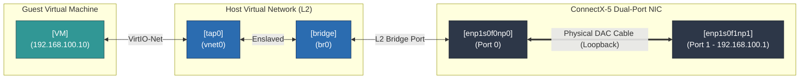

# 01 virtio-NIC (CX5) 

## 1. VM installation and how it connects to the host

`01-build_guest_image.sh` pulls a Fedora containerdisk via podman, extracts the raw disk, bakes `iperf3`/`sysstat`/`qperf` in via `virt-customize`, layers a writable qcow2 overlay on top, and generates a cloud-init seed (static user `bench` with SSH key auth, static IP on `ens3`). `launch_virtio.sh` boots it with QEMU using `virtio-net-pci` + `vhost=on`, backed by a tap device (`vnet0`) plugged into a Linux bridge (`br0`) that also holds the physical CX-5 port0.

## 2. Host-side network configuration 

host_network_setup.sh 

- `br0` — pure L2 bridge, no IP, holds `port0` + `vnet0` as members
- `port0` (`enp1s0f0np0`) — bridge member, physically DAC-looped to `port1`
- `port1` (`enp1s0f1np1`) — carries the host's test IP (`192.168.100.1/24`); this is where `iperf3`/`qperf` run as client against the guest
- vCPU threads and `vhost-net` kernel threads pinned to disjoint isolated cores; hugepages back guest RAM

## 3. Test topology

Guest VM (ens3)
Static IP, iperf3 + qperf
          │
          ▼
vnet0 (tap)
vhost-net kernel thread
          │
          ▼
br0 + port0
Bridge, L2 only, no IP
          │
 DAC loopback cable
          ▼
port1 (host)
Host IP, test client

## 4. What's captured per run in `results/<RUN>/`

| File | Contents |
| :--- | :---|
| `iperf3_tcp.json` | TCP throughput (parsed → `tcp_throughput_gbps`) |
| `iperf3_udp_pps.json` | Small-packet UDP → packet rate (`udp_pps`) and loss % |
| `qperf_latency.txt` | TCP/UDP round-trip latency |
| `host_cpu.log`, `qemu_threads.log`, `host_network.log` | Host `mpstat`, per-thread `pidstat` on QEMU, `sar` NIC counters |
| `guest_logs/` | Guest-side `mpstat`, interrupts before/after, `ethtool -S` |
| `ethtool_host_before/after.txt`, `interrupts_host_before/after.txt` | Host NIC counter and IRQ diffs |
| `summary.json` | Auto-parsed rollup: throughput, PPS, loss%, latency, host CPU busy% — the numbers that go straight into your comparison chart |

